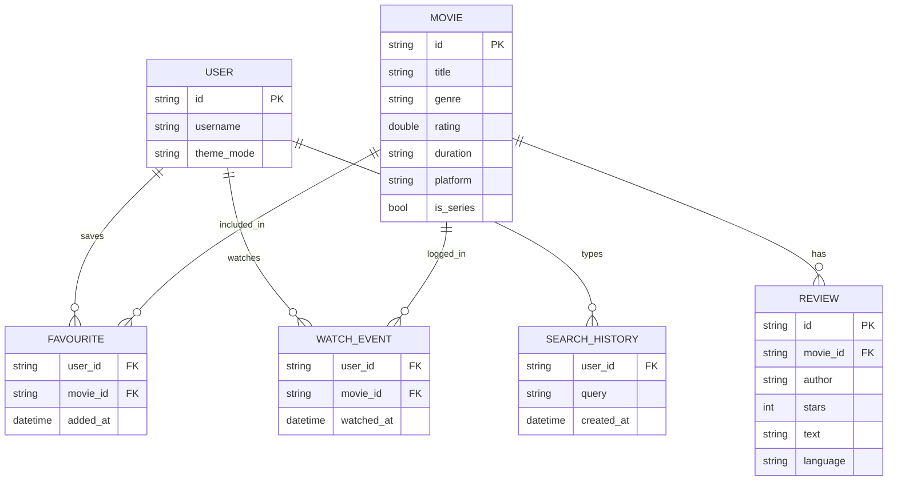

# Streamy ER Diagram

```mermaid
erDiagram
  USER {
    string id PK
    string username
    string theme_mode
  }

  MOVIE {
    string id PK
    string title
    string genre
    double rating
    string duration
    string platform
    bool is_series
  }

  REVIEW {
    string id PK
    string movie_id FK
    string author
    int stars
    string text
    string language
  }

  FAVOURITE {
    string user_id FK
    string movie_id FK
    datetime added_at
  }

  WATCH_EVENT {
    string user_id FK
    string movie_id FK
    datetime watched_at
  }

  SEARCH_HISTORY {
    string user_id FK
    string query
    datetime created_at
  }

  USER ||--o{ FAVOURITE : saves
  USER ||--o{ WATCH_EVENT : watches
  USER ||--o{ SEARCH_HISTORY : types
  MOVIE ||--o{ REVIEW : has
  MOVIE ||--o{ FAVOURITE : included_in
  MOVIE ||--o{ WATCH_EVENT : logged_in
```

